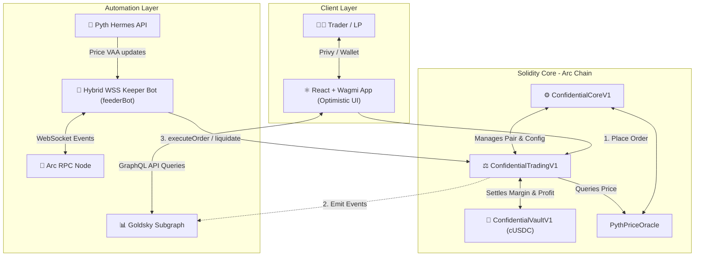

# 🚀 Confidential DEX

[](https://testnet.arcscan.app)
[](https://react.dev/)
[](https://soliditylang.org/)
[](#)

**The frictionless on-chain trading engine on Arc Network. Unified USDC for gas & collateral means zero Web3 onboarding friction.**

[🌟 **View Live App**](https://confidentialdex.vercel.app) (Replace with your actual Vercel URL) | [📖 **Read Documentation**](#-key-features)


Confidential DEX is a next-generation Decentralized Perpetual Exchange built on the Arc Network. By combining a Hybrid WebSocket Keeper Network with a robust Dual-Tranche Liquidity Vault, we deliver a centralized-exchange-like experience (CEX) on a purely decentralized layer.

---

## ✨ Key Features

- **Frictionless Unified Trading:** On Arc Network, USDC is used for both gas fees and trading collateral. Users never need to hold a separate native token (like ETH or BNB) just to trade.
- **Zero-Borrow-Fee Perps:** Maximize your capital efficiency with zero borrow fees and up to 100x leverage.
- **Optimistic UI:** Trades feel instant. The UI anticipates on-chain execution, eliminating the standard 3-5 second subgraph indexing delay.
- **Hybrid WSS Keeper Bot:** Trades are executed in milliseconds. The Keeper bot listens to blockchain events via WebSockets, ensuring near-instant order execution without network polling delays.

---

## 🏗️ System Architecture

Confidential DEX employs an event-driven, keeper-automated execution pipeline. The system is split into three layers: the Client Web Application, the Smart Contract Execution Engine, and the Automation Infrastructure.



---

## 🏦 Protocol Core Mechanics

### 1. Dual-Tranche Vault (ERC-4626 cUSDC)
Platform liquidity is provided by depositors into a tokenized vault divided into two risk-reward segments (*tranches*) with a maximum absolute TVL cap of **$50,000,000 USDC**:

*   **Degen Vault (High Yield, High Risk):** Capped at **$15,000,000** (30% TVL). Earns **3x** the baseline share of trading fees, liquidation rewards, borrow fees, and trader losses. Absorbs the first loss when traders win.
*   **Prime Vault (Capital Protected, Low Risk):** Capped at **$35,000,000** (70% TVL). Earns 1x baseline profit shares. Mechanically protected from bankruptcy by a strict **60% capital protection floor**. If the Prime vault's assets drop to 60%, any further losses are routed entirely to the Degen Vault.

### 2. Risk Management & Safeguards
*   **Utilization Cap (80%):** Trader positions cannot be opened if the vault cash utilization exceeds 80%. This guarantees a 20% cash buffer so LPs can withdraw their capital at any time.
*   **Anti-MEV / Flash Loan Cooldown:** A mandatory 5-second cooldown is enforced between opening and closing a position to prevent sandwich and flash loan attack vectors.
*   **Dynamic Quadratic Price Impact:** To prevent market manipulation by whales, trade price impact is calculated exponentially relative to the pair's Open Interest.

---

## 📄 Contract Addresses (Arc Testnet)

| Contract | Address | Explorer Link |
| :--- | :--- | :--- |
| **ConfidentialCoreV1** | `0x0026Ceb6a0dB61224a1A94EfDDd3A37C424cF797` | [View Explorer](https://testnet.arcscan.app/address/0x0026Ceb6a0dB61224a1A94EfDDd3A37C424cF797) |
| **ConfidentialTradingV1** | `0xFE7f9dDc814D51d487510BA32BD5F611Af131C20` | [View Explorer](https://testnet.arcscan.app/address/0xFE7f9dDc814D51d487510BA32BD5F611Af131C20) |
| **ConfidentialVaultV1** | `0xd0ABFF86ED2493008A2d26C6dA44FE26581f0A79` | [View Explorer](https://testnet.arcscan.app/address/0xd0ABFF86ED2493008A2d26C6dA44FE26581f0A79) |
| **Pyth Oracle** | `0x7e8f460ebBAE6A767bC80561c322e3c589a8A3C7` | [View Explorer](https://testnet.arcscan.app/address/0x7e8f460ebBAE6A767bC80561c322e3c589a8A3C7) |

---

## 💻 Developer Setup & Installation

### Prerequisites
*   Node.js (v18+)
*   NPM (v9+)
*   [Foundry](https://book.getfoundry.sh/getting-started/installation) (for contract testing/development)

### 1. Smart Contracts
Navigate to the contracts directory and install dependencies:
```bash
cd contracts
npm install
forge build
```

### 2. Frontend Application
Navigate to the root directory and install dependencies:
```bash
npm install
```
Configure your environment variables in `.env` in the root:
```env
VITE_PRIVY_APP_ID=your_privy_app_id
VITE_ARC_RPC=https://rpc.testnet.arc.network
```
Run the local Vite development server:
```bash
npm run dev
```

### 3. Running the Keeper Bot
Run the background automation script to process orders and liquidations via WebSocket:
```bash
cd contracts
export BOT_KEEPER_PRIVATE_KEY=0xyour_keeper_private_key
node bot/feederBot.cjs
```

---

## 📜 License
This project is open-source and submitted for the Arc Network Hackathon. All smart contracts and client codes are provided as-is.
